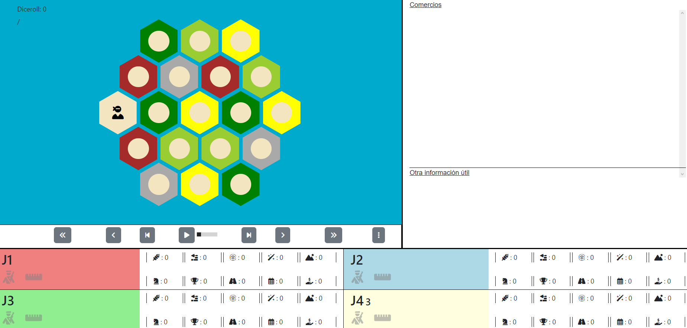

<div align="center">
  <h1>🎲 PyCatan Simulation & Genetic Optimization</h1>
  
</div>

---

## 🔍 Overview

This repository hosts a Python-based simulator for the board game **Settlers of Catan** (PyCatan). Originally designed for testing AI agents in a simulated Catan environment, this project has been extended with a **Genetic Algorithm** (using DEAP) to automatically evolve and determine which agent performs best. The simulation leverages multi-core concurrency to evaluate numerous matches in parallel for faster fitness evaluation.

---

## 🚀 Getting Started

### 🛠 Prerequisites

- **Python 3.6+**  
  Ensure you have Python installed on your machine.
- **Dependencies:**  
  The project uses several external libraries:
  - **DEAP** – for genetic algorithm functionalities.
  - **NumPy** – for numerical operations.
  - **Multiprocessing** – for concurrent simulation runs.

### 📥 Installation

1. **Clone the Repository:**
   ```bash
   git clone https://github.com/yourusername/PyCatanSimulation.git
   cd PyCatanSimulation
   ```

2. **Install Dependencies:**  
   Create a virtual environment (optional but recommended) and install the required packages:
   ```bash
   python -m venv venv
   source venv/bin/activate    # On macOS/Linux
   venv\Scripts\activate       # On Windows
   pip install -r requirements.txt
   ```

3. **Requirements File:**  
   Your `requirements.txt` should include the following dependencies:
   ```txt
   deap==1.3.1
   numpy==1.23.5
   ```
   These packages cover the genetic algorithm functionalities and numerical operations used in the simulation.

---

## 🎭 Adding or Modifying Agents

1. Navigate to the `Agents` folder.
2. Add your custom agent module or Python file in this folder.
3. Ensure your agent class is correctly defined (with an appropriate interface) so it can be imported and used in simulations.

---

## 🎮 Running the Simulator & Genetic Optimizer

1. **Execute the Main Script:**
   ```bash
   python catan.py
   ```
2. The genetic algorithm will run for a specified number of generations (default settings in `catan.py`), simulating several matches per evaluation. Multi-core processing is used to speed up the fitness evaluation.

3. **Output Details:**
   - **Best Individual:**  
     The optimized probability vector for agent selection.
   - **Optimized Distribution:**  
     The evolved distribution that maximizes the win rate of the optimized agent.
   - **Fitness Value:**  
     Number of wins in simulated games.
   - **Logbook:**  
     A CSV log (`evolution_log.csv`) detailing the evolution progress.

---

## 📊 Results

- **Console Output:**  
  Real-time statistics on each generation (average, min, and max fitness) and a summary when an optimal solution is found.
- **Logbook:**  
  Detailed evolution statistics stored in `evolution_log.csv`.
- **Agent Distribution:**  
  The best evolved probability vector determines which agent is selected for the simulated matches, maximizing win rate.

---

## 🤝 Contributing

Contributions to enhance the simulation, add new agents, or improve the genetic algorithm are welcome! Feel free to fork the repository and submit pull requests with your improvements.

---

Happy simulating and evolving your Catan strategies! 🚀

---
---

# Catan Simulation in Python

A Settlers of Catan simulator for AI agents written in Python.

## Overview

This repository contains a Python-based simulator for the board game Settlers of Catan. It is designed to test and refine AI agents in a simulated environment. Users can execute predefined agents, as well as introduce their own custom agents into the game.

## Getting Started

### Prerequisites

Ensure you have Python installed on your machine. The simulation is compatible with Python 3.x.

### Adding Your Agents

1. Navigate to the `Agents` folder.
2. Place your custom agent module or Python file in this folder.
3. Ensure your agent class is correctly defined within the module.

### Running the Simulator

To run the simulator, use the `main` module. Specify the agents to be executed and the number of games to be played. Each agent should be referenced by the module or file name, followed by a dot, and then the class name (e.g., `MyModule.MyClass`).

### Results

After each game, the result is displayed in the console and the game trace is saved in JSON format in the `Traces` folder.

## Visualizing Results

To visualize game results:
1. Open the `index.html` file located in the `Visualizer` folder.
2. Load a JSON trace file by clicking on the three-dot icon located in the controls below the right side of the Catan board.




## Contributing

Contributions to the Catan Simulation in Python are welcome! Please feel free to make changes and submit pull requests.
